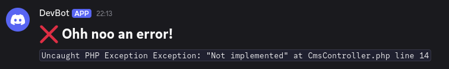

# Monolog Discord Handler

Adds a handler to monolog which can post your logs directly via discord webhook to your discord server channel.

> [!NOTE]
> Discord has a character limit of 2000 (or 4000 when you have nitro). The message will get truncated when needed.

## Installation

`composer require thedomeffm/monolog-discord-handler-bundle`

## Configure the bundle

I've not added a recipe (or whatever I need to create :shrug:), so you need to create the config by yourself.

```.dotenv
# .env
DISCORD_WEBHOOK_URL="<your webhook url>"
```

### Minimal

```yaml
# config/packages/thedomeffm_monolog_discord_handler.yaml
thedomeffm_monolog_discord_handler:
    discord:
        webhook_url: "%env(DISCORD_WEBHOOK_URL)%"
```

### Maximal

> [!NOTE]
> Have in mind that json_pretty_print makes the message longer, and you'll reach the discord char limit easier!

```yaml
# config/packages/thedomeffm_monolog_discord_handler.yaml
thedomeffm_monolog_discord_handler:
    discord:
        webhook_url: "%env(DISCORD_WEBHOOK_URL)%"

    formatting:
        characters_limit: 2000
        date_format: 'd.m.Y H:i:s'
        json_pretty_print: false
```

## Configure monolog

Add the "service" handler

```yaml
# monolog.yaml
monolog:
    handlers:
        # your other handlers...
        discord:
            type: service
            id: thedomeffm_monolog_discord_handler
```

Here is an example how a production config could look like:

```yaml
# monolog.yaml
when@prod:
    monolog:
        handlers:
            main:
                type: fingers_crossed
                action_level: error
                handler: main_group
                excluded_http_codes: [404, 405]
                buffer_size: 50

            main_group:
                type: group
                members: ['error_stream', 'discord']

            error_stream:
                type: stream
                path: php://stderr
                level: debug
                formatter: monolog.formatter.json

            discord:
                type: service
                id: thedomeffm_monolog_discord_handler

            # your other handler...
```

## Override the message content

Unhappy with my opinionated message design? Then decorate the factory.
You can pass strings or the Text class into the Discord message.

```php
// ...
use Monolog\LogRecord;
use Symfony\Component\DependencyInjection\Attribute\AsDecorator;
use TheDomeFfm\MonologDiscordHandlerBundle\Message\DiscordMessage;
use TheDomeFfm\MonologDiscordHandlerBundle\Message\DiscordMessageFactoryInterface;
use TheDomeFfm\MonologDiscordHandlerBundle\Message\Syntax;
use TheDomeFfm\MonologDiscordHandlerBundle\Message\Text;

#[AsDecorator(decorates: 'thedomeffm_monolog_discord_message_factory')]
class CustomMessageFactory implements DiscordMessageFactoryInterface
{
    public function createFromLogRecord(LogRecord $record): DiscordMessage
    {
        $message = new DiscordMessage();

        $message->append('# :x: Ohh noo an error!\n');
        $message->append(Text::create(Syntax::Code, $record->message)->render());

        return $message;
    }
}
```


